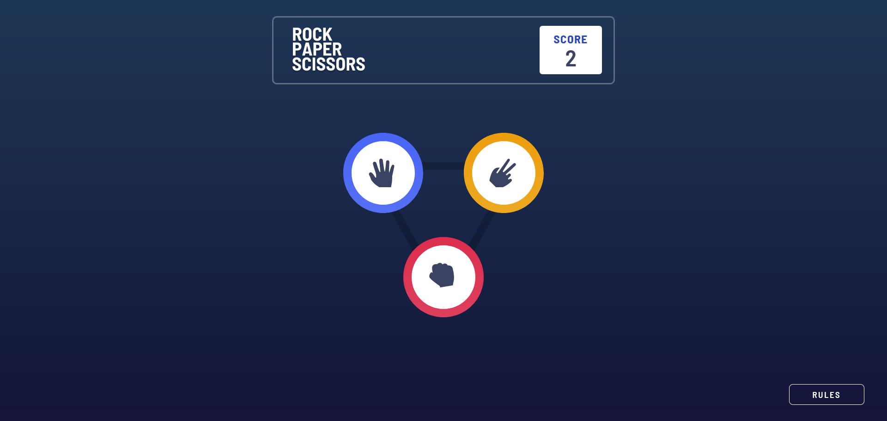

# Frontend Mentor - Rock, Paper, Scissors solution

This is a solution to the [Rock, Paper, Scissors challenge on Frontend Mentor](https://www.frontendmentor.io/challenges/rock-paper-scissors-game-pTgwgvgH). Frontend Mentor challenges help you improve your coding skills by building realistic projects. 

## Table of contents

- [Overview](#overview)
  - [The challenge](#the-challenge)
  - [Screenshot](#screenshot)
  - [Links](#links)
- [My process](#my-process)
  - [Built with](#built-with)
  - [What I learned](#what-i-learned)
  - [Continued development](#continued-development)
  - [Useful resources](#useful-resources)
- [Author](#author)
- [Acknowledgments](#acknowledgments)

## Overview

### The challenge

Users should be able to:

- View the optimal layout for the game depending on their device's screen size
- Play Rock, Paper, Scissors against the computer

### Screenshot

### Links

- Solution URL: [GitHub Repository](https://github.com/ricmrs/rock-paper-scissors)
- Live Site URL: [Rock Paper Scissors](https://rock-paper-scissors-kohl-two.vercel.app/)

## My process

### Built with

- Semantic HTML5 markup
- CSS custom properties
- Flexbox
- Mobile-first workflow
- [React](https://reactjs.org/) - JS library
- [Next.js](https://nextjs.org/) - React framework
- [Styled Components](https://styled-components.com/) - For styles
- [SkynexUI](https://skynexui.dev/) - CSS breakpoints in JS

### Useful resources

- [SkynexUI](https://skynexui.dev/) - This library let me write css breakpoints in js.

## Author

- Linkedin - [Ricardo Macedo](https://www.linkedin.com/in/ricardo-macedo-rosa-silva-bbbb22196/)
- Frontend Mentor - [@ricmrs](https://www.frontendmentor.io/profile/ricmrs)